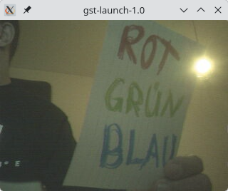

# MPFS Discovery Kit Video Pipeline

I wanted to use the camera on Microchip's MPFS Discovery-Kit[^1], but there was no
real example on the internet. So I started to rebuild stuff from the 
Video-Kit-Reference-Design[^2]. I am still far from being done, but I do have a
working camera.

## Setting up the project

This project was built with Libero SoC Design Suite v2025.2. To set it up just
start Libero, press ctrl-u and select the `create_project.tcl` file. The project
should now be setup inside a `work/` directory. After a couple of minutes the
sythesis can be started.

A little example application can be found in the `sw/` folder. To use this the 
dt-overlay has to be setup. Copy the files inside `sw/dt-overlay` to your
discovery kit and then execute them
```
chmod +x loadvdma.sh
./loadvdma.sh
```

The uio devices for vDMA and the H264 entity shall now be ready. After that 
you can compile and setup the software from the `sw/discostream` folder. There
is a Makefile to cross-compile it. This still need adjustments to make it more
generic. But if you have adjusted your settings (and have a working go
install) then it should just be `make upload` and `make templates` to upload
everything to your device. Then just do

```
ssh root@yourdevice
cd disco/
./discostream
```

The web interface should now be reachable via `http://yourdevice:8080`


Early image from gstreamer output:



Web interface for now:


## Disclaimer

Much of this was just pure trail and error, having a little bit of fun and not
knowing _exactly_ what I am doing.j Especially camera setup, timings and stuff
about the h264 configuration. Do not judge pls. Thx.

## ToDo

- More documentation
- Simple video pipeline example like sobel or gaussian blur
- adjust camera_control_tb.vhd to the current working state. It hasn't been updated

## Links 

- [^1] https://www.microchip.com/en-us/development-tool/MPFS-DISCO-KIT
- [^2] https://github.com/polarfire-soc/polarfire-soc-video-kit-reference-design

